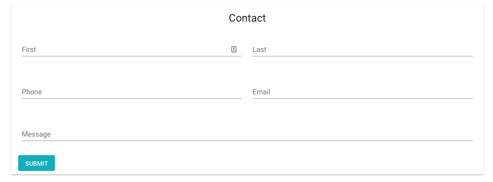

# Serverless Contact AWS
[](https://app.codeship.com/projects/345400)
[](https://travis-ci.org/EdyVision/serverless-contact-aws)

A simple contact form api written in NodeJS and built on the Serverless framework. This project leverages AWS SES for email notifications.

## What Can I Do With This?
Attach a contact form such as the one in the image below and have people contact you directly from your site.



## Setup
Have serverless installed locally and on your CI/CD pipeline:

```
npm install -g serverless
```

Make sure that you have your AWS Key and Secret in your env vars or bash profile:

```
export AWS_ACCESS_KEY_ID="YOUR_ACCESS_KEY_ID"
export AWS_SECRET_ACCESS_KEY="YOUR_SECRET_ACCESS_KEY"
```


## Deployment
To deploy to AWS locally, make sure you have your AWS key and secret in your bash profile and execute the following:

```
INFO_EMAIL="youremail@domain.com" sls deploy -v
```

## Usage

To execute locally, run the following command (<strong>npm install serverless -g</strong> is required):

```
INFO_EMAIL="youremail@domain.com" sls offline --noAuth
```

If running locally, the beginning of your url will be http://localhost:3000

Then you can send the following JSON body to "http://<url>/system/notifications/submitEmail":

```
{
	"fromAddress":"test@test.com",
	"subject":"Test",
	"message":"Test,Contact John Doe, Email: test@test.com, Phone: 555-555-5555",
	"isSystemEmail": true
}
```

Successful Email Submission Response

```
{
    "statusCode": 201,
    "body": "{\"ResponseMetadata\":{\"RequestId\":\"fe1bd4f2-84b3-11e9-a3a7-61cdb4744f3e\"},\"MessageId\":\"0100016b14f04c14-ba6db20c-748c-439b-9789-f870066d7ed1-000000\"}",
    "headers": {
        "Access-Control-Allow-Origin": "*",
        "Access-Control-Allow-Headers": "x-requested-with",
        "Access-Control-Allow-Credentials": true
    }
}
```

Unverified Email Error Response

```
{
    "statusCode": 500,
    "body": {
        "message": "Email address is not verified. The following identities failed the check in region US-EAST-1: test@test.com",
        "code": "MessageRejected",
        "time": "2019-06-01T21:24:10.080Z",
        "requestId": "6eacc776-84b3-11e9-b4ea-17b8cd3bf01c",
        "statusCode": 400,
        "retryable": false,
        "retryDelay": 80.13833346952002
    }
}
```

## CI/CD

Please find the travisci settings in the project root. Alternatively, if you would like to use Codeship, the following setup is currently used:

Setup Commands

```
npm install
npm i serverless -g
```

Test Commands

```
npm test
```

Deploy Commands (set for master)

```
INFO_EMAIL="youremail@domain.com" sls deploy -v
```